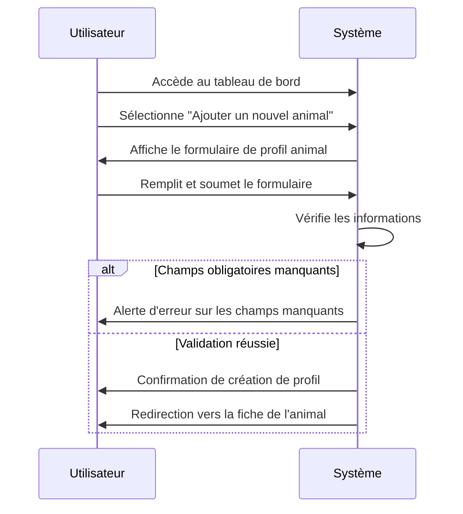
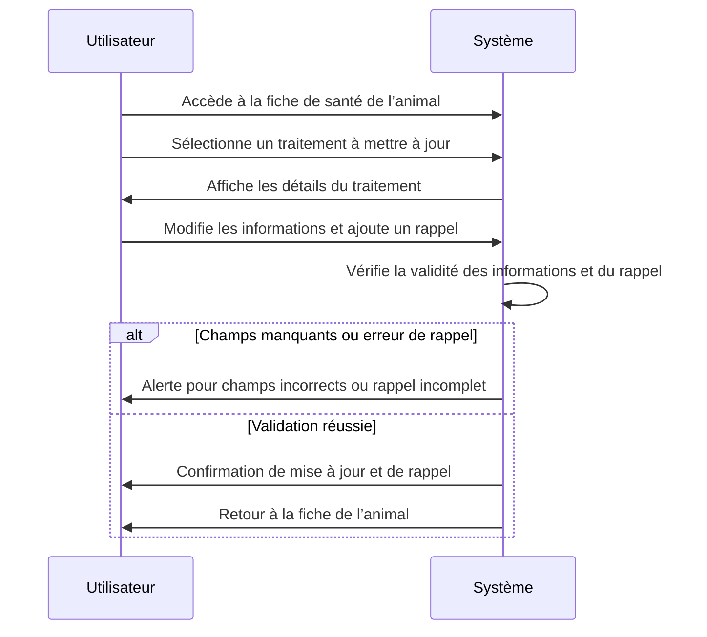
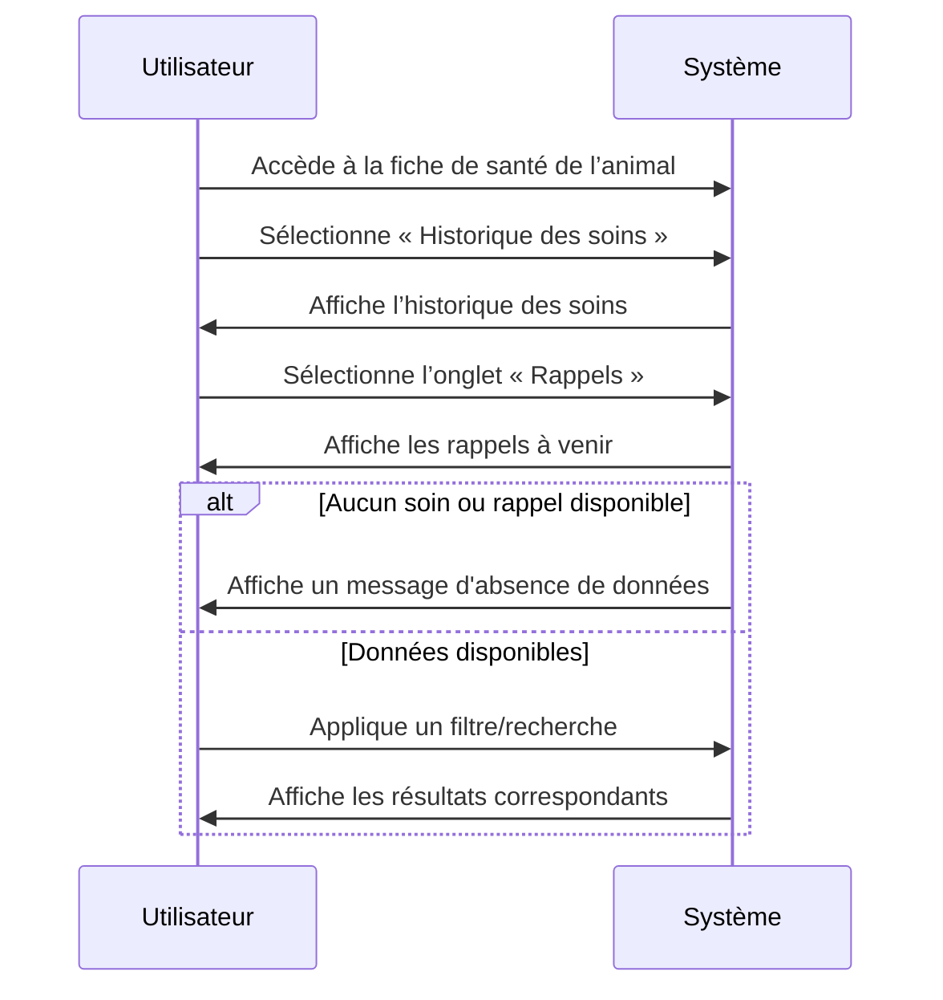
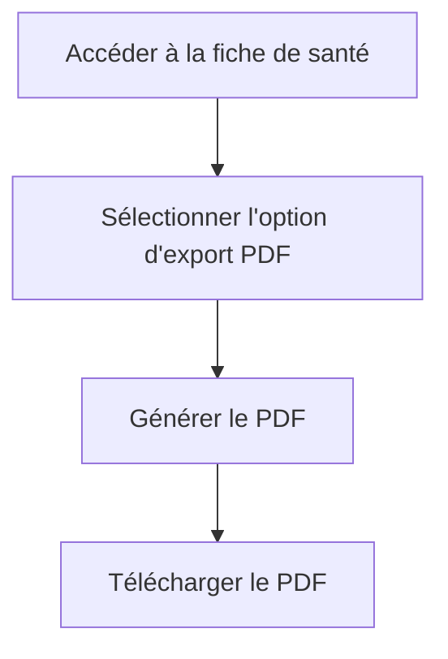
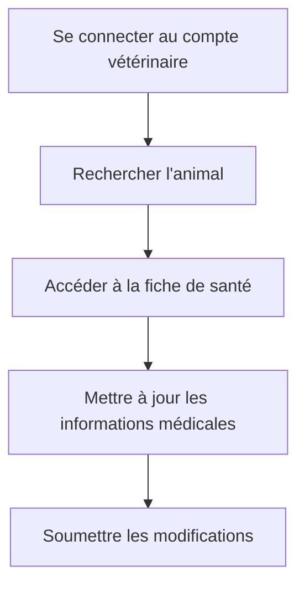

+++
title = 'Cahier des spécifications fonctionnelles'
date = 2024-10-29T08:30:00-00:00
draft = false
slug = 'cahier-specifications-fonctionnelles'
tableOfContents = true
autonumbering = false
+++

## 1. Introduction

### 1.1 Contexte du projet

La gestion de la santé des animaux de compagnie est une préoccupation importante pour les propriétaires d’animaux et les vétérinaires. Actuellement, de nombreux propriétaires conservent les informations relatives à la santé de leurs animaux sous forme papier ou dans des applications non spécifiques, ce qui rend difficile le suivi et la mise à jour des données. Un carnet de santé numérique centralisé permet de résoudre ce problème en offrant une solution accessible pour enregistrer, consulter et gérer les informations de santé des animaux.

### 1.2 Objectifs du projet

Le projet vise à développer un **Carnet de Santé Numérique pour Animaux de Compagnie** qui permettra aux utilisateurs d’enregistrer les informations de santé de leurs animaux, de suivre les vaccinations, les traitements et de recevoir des rappels pour les soins nécessaires. Ce système devrait également intégrer des fonctionnalités pour faciliter la communication avec les vétérinaires et permettre un accès sécurisé aux informations médicales.

Les principaux objectifs du projet incluent :

- **Centralisation des données de santé :** Offrir une interface où les propriétaires peuvent facilement enregistrer et consulter toutes les informations relatives à la santé de leur animal.
- **Suivi des vaccinations et traitements :** Mettre en place un système de suivi pour les vaccinations et les traitements, avec des alertes pour les dates importantes.
- **Interface vétérinaire :** Permettre aux vétérinaires d’accéder aux informations pertinentes et de les mettre à jour en fonction des consultations.
- **Interopérabilité :** Intégrer des standards comme VetXML et ICAR pour assurer la communication entre le carnet de santé numérique et d’autres systèmes vétérinaires.

Ce projet sera conçu dans le respect des besoins des utilisateurs tout en garantissant la sécurité et la confidentialité des données. Les spécifications qui suivront détailleront les fonctionnalités attendues et les exigences associées au système.

## 2. Périmètre fonctionnel

### 2.1 Description du périmètre

Le **Carnet de Santé Numérique pour Animaux de Compagnie** est destiné à centraliser et gérer les informations de santé des animaux domestiques. Ce projet se concentrera sur la création d’une application intuitive permettant aux propriétaires d’animaux d’enregistrer et de suivre l’historique médical de leurs compagnons, ainsi que d’interagir avec des vétérinaires.

Le périmètre fonctionnel du projet inclut les éléments suivants :

- **Gestion des informations personnelles de l’animal :** Enregistrement des données de base (nom, espèce, race, âge, sexe) ainsi que des détails sur la santé (antécédents médicaux, allergies, etc.).
- **Suivi des vaccinations :** Enregistrement des vaccinations reçues, dates, types de vaccins, ainsi que la gestion des rappels pour les vaccinations futures.
- **Suivi des traitements :** Enregistrement des traitements médicaux, y compris les prescriptions, les traitements préventifs (ex. antiparasitaires), et l’historique des soins.
- **Gestion des rappels et notifications :** Système de notifications configurables pour alerter les propriétaires d’animaux des vaccinations à venir, des visites vétérinaires et des traitements récurrents.
- **Interface vétérinaire :** Création d’un espace sécurisé pour les vétérinaires, leur permettant de consulter les informations de santé des animaux et de les mettre à jour lors des consultations.
- **Intégration avec des systèmes externes :** Adoption des standards VetXML et ICAR pour la synchronisation des données entre le carnet de santé numérique et les systèmes vétérinaires, garantissant ainsi une interopérabilité efficace.
- **Exportation de données :** Possibilité d’exporter les informations de santé de l’animal au format PDF pour un partage facile avec des vétérinaires ou pour une consultation personnelle.

### 2.2 Exclusions du périmètre

Il est important de noter que certaines fonctionnalités ne seront pas incluses dans le périmètre de ce projet :

- **Gestion de rendez-vous :** Bien que l’application inclura des rappels pour les visites vétérinaires, elle ne gérera pas la prise de rendez-vous ou l’agenda des vétérinaires.
- **Fonctionnalités de réseau social :** L’application ne comprendra pas de fonctionnalités de réseau social ou d’interaction entre propriétaires d’animaux.
- **Vente de produits vétérinaires :** Aucune fonctionnalité de commerce électronique ou de vente de produits vétérinaires ne sera intégrée dans cette version du carnet de santé numérique.
- **Support pour d'autres types d'animaux :** Initialement, l’application sera limitée aux animaux de compagnie (chiens et chats), sans prise en charge des animaux de ferme ou exotiques.

### 2.3 Public cible

Le public cible du **Carnet de Santé Numérique pour Animaux de Compagnie** comprend :

- **Propriétaires d’animaux de compagnie :** Cherchant à gérer facilement la santé de leurs animaux et à recevoir des rappels pour les soins nécessaires.
- **Vétérinaires :** Souhaitant accéder à des informations médicales pertinentes et mettre à jour les dossiers de santé des animaux.

Cette définition claire du périmètre fonctionnel servira de référence tout au long du développement du projet, assurant que les fonctionnalités livrées répondent aux besoins des utilisateurs tout en respectant les contraintes identifiées.

## 3. Glossaire des termes utilisés

Pour assurer une compréhension claire et partagée des concepts abordés dans ce cahier des spécifications, voici les définitions des termes spécifiques utilisés dans le cadre du projet **Carnet de Santé Numérique pour Animaux de Compagnie** :

### 3.1 Termes généraux

- **Carnet de santé numérique :** Application ou système électronique permettant de stocker et de gérer les informations de santé d’un animal de compagnie.
- **Animal de compagnie :** Animaux domestiques tels que les chiens et les chats, pour lesquels le carnet de santé numérique est conçu.

### 3.2 Fonctions spécifiques

- **Vaccination :** Acte consistant à administrer un vaccin à un animal pour le protéger contre certaines maladies. Les informations relatives à chaque vaccination (date, type de vaccin, prochain rappel) seront enregistrées dans le carnet.
- **Traitement :** Interventions médicales réalisées sur un animal, comprenant des médicaments, des traitements préventifs, ou des soins spécifiques liés à des maladies ou à des conditions de santé.
- **Rappel :** Notification envoyée à l’utilisateur pour l’informer d’une date importante à venir, comme un rendez-vous vétérinaire ou un vaccin à recevoir.
- **Interface vétérinaire :** Espace sécurisé et dédié au vétérinaire, lui permettant d’accéder aux données de santé des animaux et d’effectuer des mises à jour.

### 3.3 Intégration et communication

- **VetXML :** Standard d’échange de données entre systèmes d’information vétérinaires, permettant de faciliter la communication et l’interopérabilité des informations de santé des animaux.
- **ICAR (International Committee for Animal Recording) :** Organisation qui développe des normes pour l’enregistrement des animaux domestiques, notamment les systèmes d’identification et de traçabilité.

### 3.4 Utilisateurs

- **Propriétaire d’animal :** Utilisateur final de l’application, responsable de la gestion des informations de santé de son animal de compagnie.
- **Vétérinaire :** Professionnel de la santé animale ayant accès à l’interface vétérinaire pour consulter et mettre à jour les informations médicales des animaux.

### 3.5 Formats de données

- **PDF (Portable Document Format) :** Format de fichier standard utilisé pour l’exportation des données, permettant un partage facile et une consultation des informations hors ligne.

## 4. Fonctionnalités Principales

Cette section décrit les fonctionnalités principales du **Carnet de Santé Numérique pour Animaux de Compagnie**. Chaque fonctionnalité sera développée pour répondre aux besoins des utilisateurs et garantir une gestion efficace des informations de santé des animaux.

### 4.1 Gestion des informations de santé de l’animal

- **Enregistrement des informations de base :**
    - **Description :** Les utilisateurs pourront saisir des informations essentielles sur leur animal de compagnie, y compris :
        - **Nom :** Le nom de l'animal.
        - **Espèce :** Type d'animal (chien, chat, etc.).
        - **Race :** Race spécifique de l’animal.
        - **Âge :** Âge de l'animal, qui peut être renseigné soit en années, soit en mois.
        - **Sexe :** Sexe de l'animal (mâle, femelle).
        - **Autres informations :** Champ optionnel pour des détails supplémentaires (couleur, caractéristiques particulières, etc.).
- **Détails des vaccins :**
    - **Description :** Système d’enregistrement de l’historique des vaccinations de l’animal, comprenant :
        - **Historique des vaccins :** Liste des vaccins administrés avec les dates précises.
        - **Type de vaccin :** Identification du type de vaccin administré (ex. rabies, parvovirus).
        - **Suivi des rappels :** Notification des dates de rappel pour chaque vaccin, permettant d’assurer la conformité des soins.
        - **Prochaine date de vaccination :** Affichage clair de la prochaine date de vaccination à venir.
- **Traitements médicaux :**
    - **Description :** Suivi des traitements médicaux reçus par l'animal, avec des informations sur :
        - **Traitements réguliers :** Médicaments ou traitements administrés de manière récurrente (ex. traitements anti-parasitaires).
        - **Traitements occasionnels :** Suivi des soins médicaux ponctuels ou d’urgence.
        - **Historique des traitements :** Enregistrement des dates et des détails relatifs à chaque traitement administré.

### 4.2 Gestion des rappels et des notifications

- **Rappels de vaccination :**
    - **Description :** Système de notifications configurables qui alerte l’utilisateur des vaccinations à venir. Les utilisateurs pourront :
        - **Configurer les notifications :** Choisir la méthode de notification (email, SMS, notifications dans l'application).
        - **Recevoir des alertes :** Notifications automatiques envoyées à l’approche de la date de rappel, pour s’assurer que les soins nécessaires sont effectués à temps.
- **Suivi des visites vétérinaires :**
    - **Description :** Fonctionnalité permettant aux utilisateurs de garder un historique des visites chez le vétérinaire, y compris :
        - **Historique des visites :** Enregistrement des dates des consultations, des raisons de la visite et des traitements prescrits.
        - **Notifications de contrôle :** Alertes pour les visites de contrôle prévues, garantissant que les propriétaires ne manquent pas de rendez-vous importants pour la santé de leur animal.
- **Gestion des traitements récurrents :**
    - **Description :** Suivi et notification des soins périodiques que l’animal doit recevoir, avec :
        - **Paramètres de notification :** Options pour définir la fréquence des notifications (quotidienne, hebdomadaire, mensuelle) pour les traitements réguliers, comme les antiparasitaires ou les médicaments chroniques.
        - **Suivi des traitements administrés :** Historique des traitements effectués, permettant de s'assurer que l’animal reçoit les soins appropriés en temps voulu.

## 5. Fonctionnalités Additionnelles

Cette section présente les fonctionnalités additionnelles du **Carnet de Santé Numérique pour Animaux de Compagnie**, qui viendront enrichir l’expérience utilisateur et améliorer l’interaction entre propriétaires et vétérinaires.

### 5.1 Interface dédiée pour les vétérinaires

- **Accès sécurisé pour les vétérinaires :**
    - **Description :** Mise en place d’une interface spécifique pour les vétérinaires, garantissant un accès sécurisé aux informations médicales des animaux. Les caractéristiques incluent :
        - **Création de comptes vétérinaires :** Chaque vétérinaire disposera d’un compte personnel avec des identifiants uniques.
        - **Niveaux de droits :** Gestion des droits d'accès en fonction du rôle des utilisateurs (vétérinaires, assistants, etc.), permettant ainsi de restreindre ou d'élargir l'accès à certaines fonctionnalités ou données.
- **Possibilité de mise à jour par le vétérinaire :**
    - **Description :** Les vétérinaires auront la capacité de mettre à jour les informations de santé des animaux après chaque consultation. Cela comprend :
        - **Ajout de notes de consultation :** Possibilité d’enregistrer des observations, diagnostics et traitements prescrits.
        - **Modification des données :** Capacité de corriger ou d’ajouter des informations à l’historique médical, assurant que les données sont toujours à jour.

### 5.2 Intégration de VetXML et ICAR

- **Compatibilité avec VetXML :**
    - **Description :** Mise en œuvre d’un système d’échange d’informations permettant la synchronisation directe avec les bases de données vétérinaires, avec :
        - **Échange d'informations :** Faciliter la communication entre le carnet de santé numérique et d'autres systèmes vétérinaires, permettant ainsi un accès immédiat aux informations pertinentes.
        - **Standardisation des données :** Utilisation de formats standardisés pour garantir que les données sont comprises et interprétées correctement par différents systèmes.
- **Intégration ICAR :**
    - **Description :** Adoption des standards ICAR pour le suivi et l’identification des animaux, incluant :
        - **Reconnaissance des micropuces :** Support pour la reconnaissance et la gestion des micropuces afin de faciliter l'identification des animaux enregistrés.
        - **Suivi des antécédents :** Accès aux informations sur l’historique d’enregistrement et de vaccination des animaux, contribuant à une meilleure gestion de leur santé.

### 5.3 Export des données en PDF

- **Export du carnet de santé :**
    - **Description :** Fonctionnalité permettant aux utilisateurs de générer un PDF du carnet de santé de leur animal, offrant des options de personnalisation telles que :
        - **Inclusion d’informations spécifiques :** Possibilité de sélectionner quelles sections inclure dans l’export (vaccins, traitements, visites vétérinaires).
        - **Historique complet :** Option d’inclure l’historique complet des soins et des traitements, facilitant le partage des informations avec d'autres vétérinaires ou lors de visites médicales.

## 6. Cas d’utilisation principaux

Cette section décrit les principaux cas d'utilisation du **Carnet de Santé Numérique pour Animaux de Compagnie**. Chaque cas d'utilisation illustre un scénario d'interaction typique entre l'utilisateur et l'application.

### 6.1 Cas d’utilisation 1 : Création d’un profil pour un nouvel animal

- **Acteurs :** Propriétaire d'animal.
- **Description :** L'utilisateur saisit les informations de base de son animal afin de créer un nouveau profil dans l'application.
- **Étapes :**
    1. L'utilisateur accède à la fonction de création de profil.
    2. Il remplit les informations nécessaires (nom, espèce, race, âge, sexe).
    3. L'utilisateur soumet le formulaire.
    4. Le système crée le profil et confirme la création.
- **Informations obligatoires** :
    - Nom
    - Espèce (ex. : chien, chat)
    - Race
    - Âge (avec unité en années ou mois)
    - Sexe
- **Informations optionnelles** :
    - Couleur
    - Caractéristiques spécifiques
    - Allergies connues



### 6.2 Cas d’utilisation 2 : Mise à jour d’un traitement et ajout d’un rappel

- **Acteurs :** Propriétaire d'animal.
- **Description :** L'utilisateur modifie les détails d'un traitement en cours et configure un rappel pour le prochain soin.
- **Étapes :**
    1. L'utilisateur accède à la fiche de santé de l'animal.
    2. Il sélectionne le traitement à mettre à jour.
    3. L'utilisateur modifie les détails nécessaires.
    4. Il configure un rappel pour le traitement.
    5. L'utilisateur soumet les modifications.



### 6.3 Cas d’utilisation 3 : Consultation des historiques de soins et des rappels

- **Acteurs :** Propriétaire d'animal et vétérinaire.
- **Description :** L'utilisateur accède aux fiches de santé pour visualiser l’historique des soins de l'animal et les rappels à venir.
- **Étapes :**
    1. L'utilisateur se connecte à son compte.
    2. Il accède à la section des historiques de soins.
    3. L'utilisateur sélectionne l'animal.
    4. Le système affiche l'historique des soins et les rappels.
- **Exceptions et Gestion des erreurs :**
    1. **Aucun soin documenté** : Si aucun soin n’a été enregistré pour l’animal, le système affiche un message « Aucun soin disponible » dans l’historique.
    2. **Aucun rappel configuré** : Si aucun rappel n’a été configuré pour l’animal, le système indique « Aucun rappel programmé » dans la section des rappels.
    3. **Recherche ou filtre sans résultat** : Si l’utilisateur effectue une recherche ou applique un filtre qui ne correspond à aucun soin ou rappel, le système affiche un message « Aucun résultat correspondant ».
    4. **Erreur de chargement des données** : Si une erreur de chargement survient, le système affiche un message d’erreur et propose de réessayer.



### 6.4 Cas d’utilisation 4 : Export du carnet en PDF pour une consultation extérieure

- **Acteurs :** Propriétaire d'animal.
- **Description :** L'utilisateur génère un PDF du carnet de santé de son animal pour une consultation vétérinaire externe.
- **Étapes :**
    1. L'utilisateur accède à la fiche de santé de l'animal.
    2. Il sélectionne l'option d'exporter en PDF.
    3. Le système génère le PDF.
    4. L'utilisateur télécharge le PDF.



### 6.5 Cas d’utilisation 5 : Mise à jour des informations par le vétérinaire

- **Acteurs :** Vétérinaire.
- **Description :** Le vétérinaire accède au profil de l'animal pour mettre à jour les informations médicales suite à une consultation.
- **Étapes :**
    1. Le vétérinaire se connecte à son compte.
    2. Il recherche l'animal dans le système.
    3. Le vétérinaire accède à la fiche de santé.
    4. Il met à jour les informations médicales.
    5. Le vétérinaire soumet les modifications.



## 7. Description de l’interface utilisateur (UI)

L'interface utilisateur (UI) est un élément crucial de l'expérience utilisateur (UX) de l'application, car elle détermine comment les utilisateurs interagissent avec les fonctionnalités proposées. Une interface bien conçue doit être intuitive, accessible et cohérente, permettant aux utilisateurs de naviguer facilement à travers les différentes sections de l'application.

Cette section décrit en détail les composants de l'interface ainsi que les différentes pages de l'application, en fournissant des wireframes pour illustrer la structure et la disposition des éléments.

L’objectif est de s’assurer que l’application répond aux besoins des utilisateurs tout en respectant les normes de design modernes. Chaque composant de l'interface sera réfléchi pour faciliter l'interaction et améliorer l'engagement des utilisateurs, qu'ils soient propriétaires d'animaux ou vétérinaires.

Dans cette section, nous allons explorer les principaux composants de l'interface, qui incluent le menu de navigation, le footer, et les composants réutilisables. Ensuite, nous aborderons les différentes pages de l'application, en précisant leur fonction et leur agencement.

### 7.1 Composants de l'interface

Cette section décrit en détail les différents composants de l'interface utilisateur qui seront présents dans l'application. Chaque composant a été conçu pour assurer une navigation fluide et intuitive, tout en respectant les standards de design et d'accessibilité. Les graphiques SVG suivants illustrent une disposition minamale pour le fonctionnement des composants et des pages décrites. Cette partie n’a pas pour objectif d’être exhaustive, mais de montrer les interfaces minimales disponibles pour les utilisateurs du site.

#### 1. Menu de navigation

Le menu de navigation est un élément central de l'interface, permettant aux utilisateurs d'accéder rapidement aux différentes sections de l'application. Il peut être situé en haut de l'écran (menu supérieur) ou sur le côté (menu latéral), selon les préférences de design.


#### **2. Footer**

Le footer est une section essentielle de chaque page, fournissant des informations supplémentaires, des liens utiles et des mentions légales. Il est généralement fixe en bas de l’écran et est accessible sur toutes les pages.


#### **3. Composants réutilisables**

Ces éléments d'interface incluent des boutons, des formulaires, des notifications et des alertes. Ils sont utilisés de manière cohérente à travers les différentes pages pour améliorer l’expérience utilisateur.


### 7.2 Pages Non Connectées

**1. Page d'accueil non connectée**

Cette page sert de point d'entrée pour les utilisateurs qui ne sont pas encore connectés. Elle présente les fonctionnalités principales de l'application, telles que la gestion des animaux, la prise de rendez-vous vétérinaires et l'accès à un carnet de santé numérique. La page inclut des incitations claires pour encourager les utilisateurs à créer un compte ou à se connecter.


**2. Page de connexion**

Cette page présente un formulaire d'authentification pour les propriétaires d'animaux et les vétérinaires. Les utilisateurs peuvent saisir leur adresse e-mail et leur mot de passe pour se connecter. Un lien est également fourni pour permettre la récupération de mot de passe en cas d'oubli.


**3. Page de création de compte**

Cette page présente un formulaire d'authentification pour les propriétaires d'animaux et les vétérinaires. Les utilisateurs peuvent saisir leur adresse e-mail et leur mot de passe pour se connecter. Un lien est également fourni pour permettre la récupération de mot de passe en cas d'oubli.


**4. Page de contact**

Cette page permet aux utilisateurs de soumettre des questions ou des demandes d'assistance via un formulaire. Les utilisateurs peuvent entrer leur nom, leur adresse e-mail, et leur message. Un bouton d'envoi est également inclus pour faciliter l'envoi des demandes. Si l’utilisateur est connecté les champs mail et nom sont masqués.

Le champs sujet est une boite d’autocomplétion qui permet à l’utilisateur de choisir un sujet s’il est référencé, mais peut lui permettre aussi de proposer un sujet non référencé.


**4. Page mentions Légales**

La page des mentions légales est essentielle pour respecter la législation en vigueur, en particulier en matière de protection des données et de transparence. Voici ce qu'elle devra contenir :

1. **Identité de l'Éditeur** : Nom ou raison sociale de l'entreprise, Adresse du siège social, numéro de téléphone, adresse e-mail de contact, Numéro d'inscription au registre du commerce (RCS) et numéro de TVA intracommunautaire (le cas échéant).
2. **Directeur de la Publication** : Nom de la personne responsable de la publication du site (généralement le PDG ou le fondateur).
3. **Hébergeur** : Nom et adresse de l'hébergeur du site, Numéro de téléphone de l'hébergeur.
4. **Conditions d'Utilisation** : Règles concernant l'utilisation du site et des services proposés. Avertissement sur le droit d'auteur et la propriété intellectuelle.
5. **Protection des Données Personnelles** : Politique de confidentialité en lien avec la collecte et le traitement des données personnelles. Droits des utilisateurs concernant leurs données (accès, rectification, suppression, etc.).
6. **Cookies** : Politique de gestion des cookies et informations sur leur utilisation sur le site.
7. **Litiges** : Informations sur la résolution des litiges et le droit applicable.


### 7.3 Page Connectées

#### **7.3.1 Page d'accueil (connectée)**

Cette page est le tableau de bord principal pour les utilisateurs connectés. Elle présente un aperçu des animaux enregistrés, des notifications concernant les soins à apporter, et des rappels de rendez-vous vétérinaires.


#### 7.3.2 Page de création d'un animal

Cette page permet aux utilisateurs d'enregistrer un nouvel animal dans leur profil. Un formulaire est proposé pour saisir les informations de base telles que le nom, l'espèce, la race, la date de naissance et des informations médicales de base.

La page de création d'un animal contient donc les éléments suivants :

- **Titre de la page :** "Créer un Nouvel Animal"
- **Formulaire :**
    - Champ pour le **Nom** de l'animal (input text)
    - Champ pour l'**Espèce** (sélecteur avec options comme "Chien", "Chat", etc.)
    - Champ pour la **Race** (input text ou sélecteur selon l'espèce choisie)
    - Champ pour la **Date de Naissance** (input date)
    - Champ pour des **Informations Médicales** (textarea)
- **Boutons :**
    - Un bouton pour **Soumettre** le formulaire
    - Un bouton pour **Annuler** et revenir à la page précédente


#### 7.3.3 Page d'un animal - fiche de santé

Cette page présente des sections dédiées pour visualiser les informations médicales de l'animal, telles que les vaccinations, les traitements et les visites vétérinaires. Les utilisateurs peuvent également ajouter de nouvelles informations ou modifier les existantes comme le nom de l’animal, son espèce ou sa race.

Les vaccinations montrent un indicateur selon leur statut. Une première proposition pourrait être une indication de couleur :

- **Rouge** pour les vaccinations expirées.
- **Orange** pour celles à renouveler dans moins d'un mois.
- **Vert** pour celles à jour.


---

#### 7.3.4 Page agenda

Cette page offre une vue calendrier affichant les rappels et les dates importantes concernant les soins des animaux. Les utilisateurs peuvent également ajouter de nouveaux événements ou modifier les existants.


#### 7.3.5 Page de configuration

Cette page permet aux utilisateurs de personnaliser leurs préférences, y compris la fréquence et les canaux de notification liés à leurs animaux. Les utilisateurs peuvent également gérer leurs informations de compte.


#### 7.3.6 Page profil voir page configuration

### 7.4 Pages vétérinaire

#### 7.4.1 Page tableau de bord vétérinaire

Cette page fournit un tableau de bord spécifique aux vétérinaires, permettant de visualiser l'historique médical des animaux, de gérer les visites, et d'accéder aux informations pertinentes des propriétaires.


Image à remplacer

Wireframe SVG

```
svg
Copier le code
<svg width="800" height="600" xmlns="http://www.w3.org/2000/svg">
  <!-- Placeholder pour la page tableau de bord vétérinaire -->
</svg>

```


Image à remplacer

Wireframe SVG

```
svg
Copier le code
<svg width="300" height="600" xmlns="http://www.w3.org/2000/svg">
  <!-- Placeholder pour la page tableau de bord vétérinaire -->
</svg>

```

---

#### 7.4.2 Page d'un animal — Vétérinaire

Cette page permet aux vétérinaires d'accéder aux informations médicales d'un animal spécifique et de mettre à jour les données en fonction des traitements effectués.

Ils peuvent

- éditer une vaccination ou l’ajouter
- éditer un traitement, ajouter un traitement, terminer un traitement, voir les traitements terminés
- voir la liste des visites, programmer une visite


## 8. Contraintes et spécifications non fonctionnelles

Cette section présente les exigences et contraintes techniques à respecter pour assurer une expérience utilisateur fluide et une bonne gestion des données du **Carnet de Santé Numérique pour Animaux de Compagnie**.

### 8.1 Performance et fiabilité

- **Temps de réponse :** Les actions de base (consultation, mise à jour, ajout de données) doivent être réalisées avec un temps de réponse inférieur à 2 secondes pour une expérience utilisateur optimale.
- **Disponibilité :** L'application doit être disponible en continu (24/7) avec un taux de disponibilité minimum de 99,5 %.
- **Tolérance aux pannes :** Les données importantes, comme les fiches de santé des animaux, doivent être sauvegardées et protégées pour éviter toute perte d'information.

### 8.2 Sécurité

- **Authentification et autorisation :** Une authentification sécurisée est requise pour accéder aux informations sensibles. Les vétérinaires et propriétaires auront des niveaux d'accès différents.
- **Protection des données sensibles :** Toutes les données personnelles et médicales doivent être protégées, en particulier lors des transferts et du stockage, conformément aux standards de confidentialité.
- **Journalisation :** Une trace des actions importantes (création, modification, suppression de données) doit être conservée à des fins de suivi et de transparence.

### 8.3 Compatibilité et portabilité

- **Support multi-plateforme :** L'application doit être compatible avec les principaux navigateurs (Chrome, Firefox, Safari, Edge) et accessible sur mobile et tablette pour une meilleure expérience utilisateur.
- **Standardisation des données :** Utilisation des formats VetXML et ICAR pour assurer la compatibilité avec d’autres systèmes vétérinaires.

### 8.4 Évolutivité et maintenance

- **Évolutivité :** L’architecture doit être conçue de manière à pouvoir gérer une augmentation du nombre d’utilisateurs et de données sans dégradation des performances.
- **Facilité de maintenance :** Le code et la documentation doivent être clairs et bien structurés pour faciliter la maintenance et les mises à jour ultérieures.

### 8.5 Accessibilité

- **Conformité aux normes d'accessibilité :** L’interface utilisateur doit respecter les standards d’accessibilité (WCAG 2.1 niveau AA) pour permettre aux utilisateurs en situation de handicap de naviguer aisément.
- **Ergonomie :** L’application doit proposer une interface intuitive avec une navigation simplifiée, adaptée aussi bien aux utilisateurs vétérinaires qu’aux propriétaires d’animaux.

## 9. Ergonomie et Expérience Utilisateur

Cette section décrit les principes d'ergonomie et d'expérience utilisateur qui guideront la conception du **Carnet de Santé Numérique pour Animaux de Compagnie**. L’objectif est de garantir une interface intuitive, accessible à tous les niveaux d’utilisateurs.

### 9.1 Facilité d’utilisation

- **Simplicité d’accès** : L'interface sera conçue pour permettre une navigation rapide et intuitive. L’utilisateur doit pouvoir accéder aux informations principales en un minimum de clics.
- **Consultation des informations** : Les données de santé de l’animal (vaccins, traitements, rappels) seront présentées de manière claire et hiérarchisée, facilitant leur lecture et leur compréhension.

### 9.2 Conception centrée utilisateur

- **Accessibilité universelle** : L’application sera optimisée pour être utilisée par des personnes de tout niveau technique, y compris celles ayant peu d'expérience avec les outils numériques.
- **Interface épurée et ergonomique** : Les pages auront une disposition épurée, évitant la surcharge d'informations. La navigation sera fluide, avec des boutons et des sections bien identifiés.
- **Optimisation pour les actions courantes** : Les tâches fréquentes (ajout de nouveaux animaux, mise à jour des informations, consultation du calendrier) seront priorisées et mises en avant dans l’interface pour réduire le nombre d’étapes nécessaires.